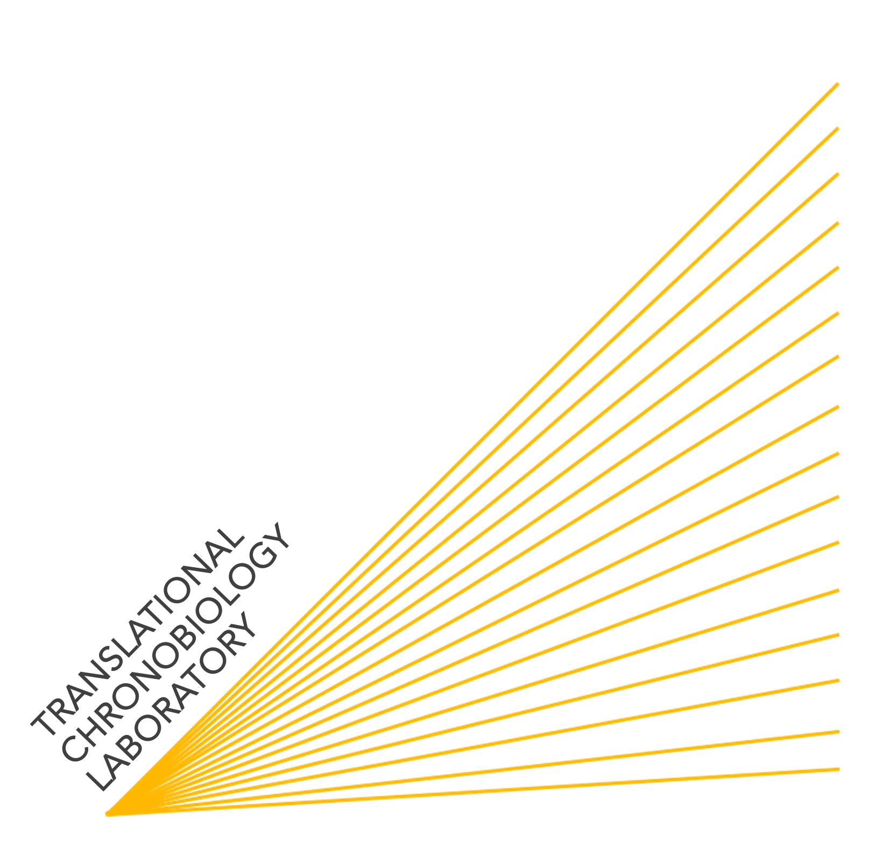

{width="294"} 

# Team

## Postgraduate Students

-   **Cansu Ozkucukler** 

-   **Meric Celik** 

-   **Sena Gulsum Akgun** 

## Undergraduate Research Students

-   **Burcu Gemici** 

-   **Zeynep Kayar** 

-   **Nilufer Bilgin** 

-   **Berna Alkan** 

-   **Ece Vahide Zeybek** 

## Alumni

-   **Berkay Ekinci**  previously: Undergraduate Research
    Student  next: Izmir Institute of Technology  [personal
    page](https://www.linkedin.com/in/berkayekinci/)

-   **Esin Simge Guler**  previously: Undergraduate Research
    Student  next: Heidelberg University  [personal
    page](https://www.linkedin.com/in/esin-simge-g%C3%BCler-15593824b/)

-   **Halil Kaan Turk**  previously: Undergraduate Research
    Student  now: University of Tubingen  [personal
    page](https://www.linkedin.com/in/halil-kaan-t%C3%BCrk-33396a1b7/)

-   **Onur Bayram**  previously: Undergraduate Research Student 
    next: University of Vienna  [personal
    page](https://www.linkedin.com/in/obito/)

-   **Aleyna Nur Erim**  previously: Undergraduate Research
    Student  next: University of Helsinki  [personal
    page](https://www.linkedin.com/in/aleynanurerim/)

-   **Furkan Mert Kervan**  previously: Undergraduate Research
    Student  next: Izmir Institute of Technology  [personal
    page](https://www.linkedin.com/in/furkan-mert-kervan-b0020b199/)

-   **Eray Yildiz**  previously: Undergraduate Research
    Student  next: The University of Bonn   [personal
    page](https://www.linkedin.com/in/eray-y%C4%B1ld%C4%B1z-b0857a204/?originalSubdomain=tr)

